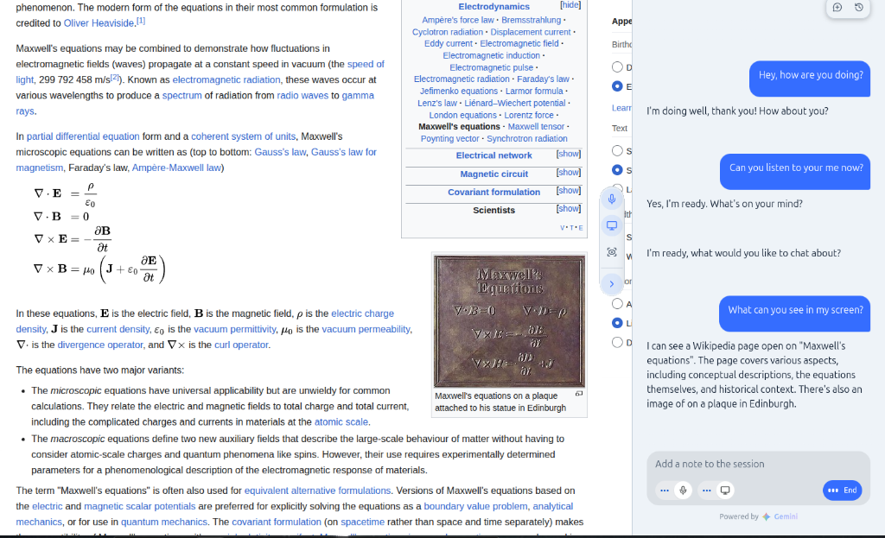
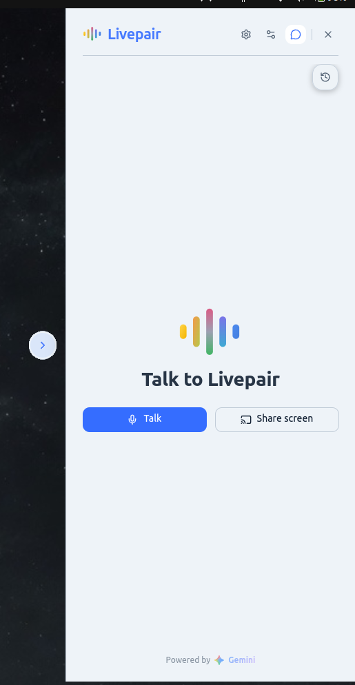
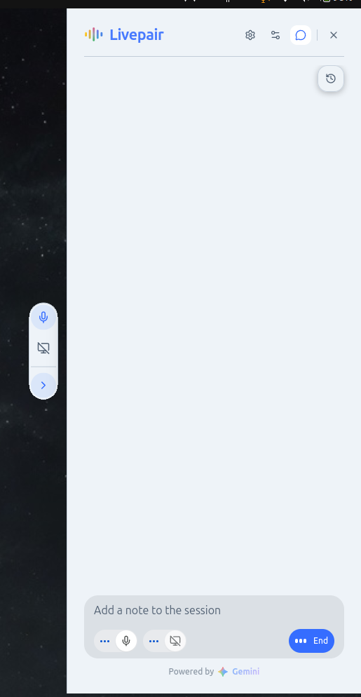
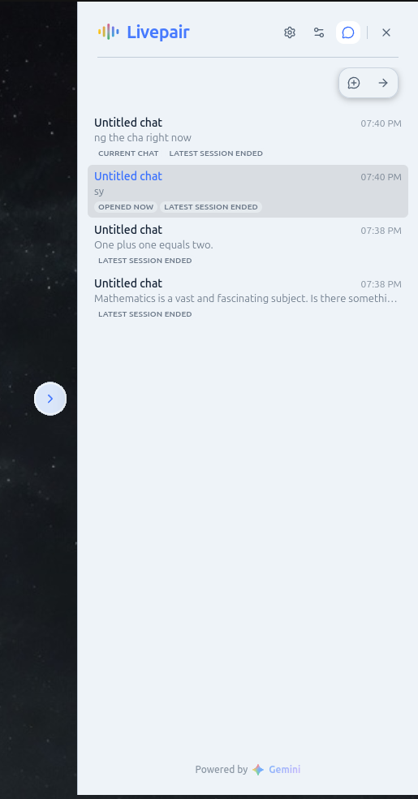
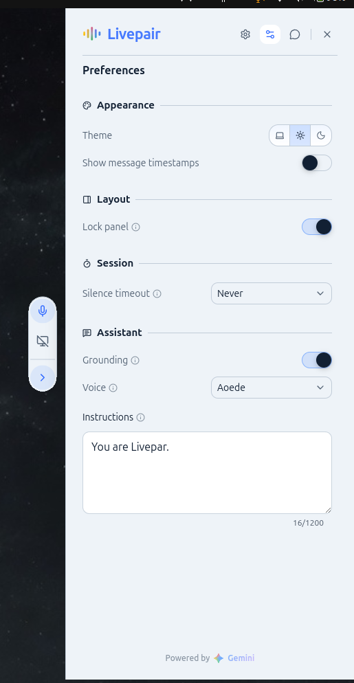
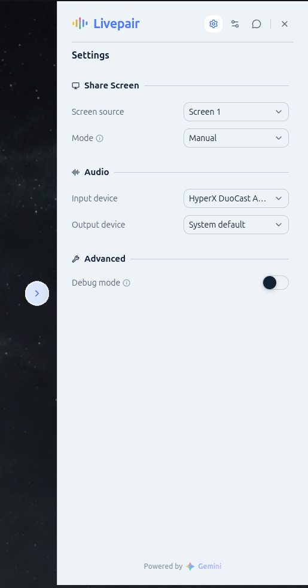
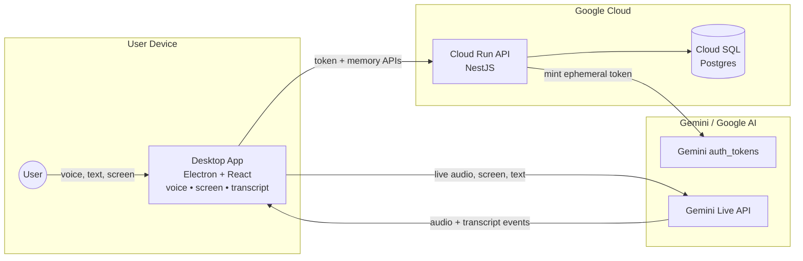
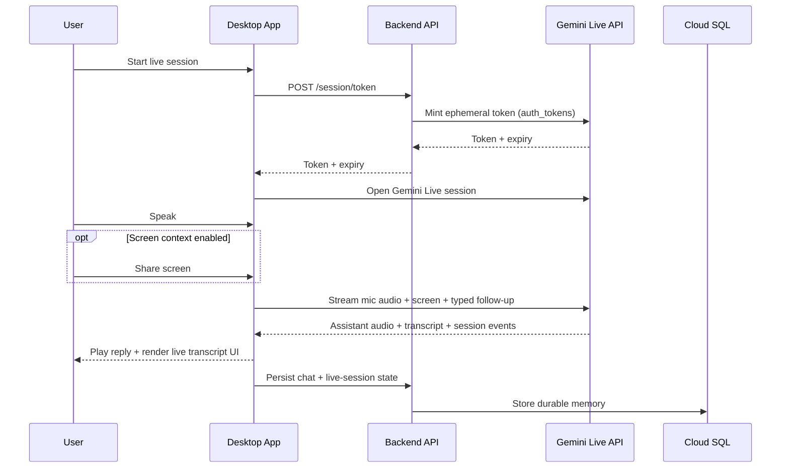
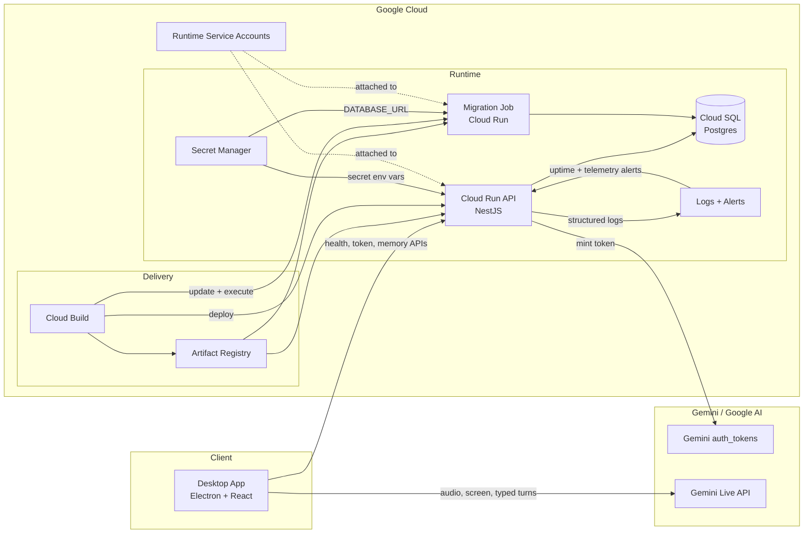

# Livepair

Livepair is a realtime multimodal desktop assistant that uses Gemini Live API to combine voice, screen context, and transcript-aware responses in an Electron app backed by a NestJS API that is designed to run on Google Cloud Run.



## Quick Start

### Prerequisites

- Node.js LTS
- `pnpm` 9.x
- Docker Engine with Docker Compose
- Linux desktop environment with microphone and screen-capture support

### 1) Install dependencies

```bash
pnpm install
```

### 2) Create local environment files

```bash
cp apps/api/.env.example apps/api/.env
cp apps/desktop/.env.example apps/desktop/.env
cp infra/postgres/.env.example infra/postgres/.env
```

### 3) Set required environment values

In `apps/api/.env`, set your Gemini API key:

```bash
GEMINI_API_KEY=your-gemini-api-key
```

Keep these values aligned:

- `SESSION_TOKEN_AUTH_SECRET` must match in `apps/api/.env` and `apps/desktop/.env`
- `SESSION_TOKEN_LIVE_MODEL` in the API should match `VITE_LIVE_MODEL` in the desktop app
- `VITE_LIVE_API_VERSION` should remain `v1alpha` for the current speech flow

### 4) Start local PostgreSQL

```bash
make postgres-up
```

### 5) Run the backend

```bash
pnpm --filter @livepair/api dev
```

The API is available at `http://127.0.0.1:3000` by default.

### 6) Run the desktop app

```bash
pnpm --filter @livepair/desktop dev
```

If you want to start both apps together instead:

```bash
pnpm run dev
```

Useful checks:

```bash
make smoke-check
curl http://127.0.0.1:3000/health
```

### 7) Build Ubuntu desktop artifacts

The repository now includes a Linux packaging flow for the desktop app that uses the Electron runtime already installed in the workspace.

Build the artifacts from the repo root:

```bash
pnpm dist:desktop:linux
```

Artifacts are written under `apps/desktop/release/linux/<arch>/`:

- portable Linux bundle directory
- `.deb` package
- `.AppDir` staging directory
- `.AppImage` when `appimagetool` is installed on the host

Production configuration is still provided outside version control. Create a `livepair.env` file from `apps/desktop/.env.example` and set at least:

```bash
SESSION_TOKEN_AUTH_SECRET=replace-with-your-production-secret
BACKEND_URL=https://your-production-api.example.com
```

Use the env file in one of these locations:

- next to the portable launcher or extracted `.AppImage` as `livepair.env`
- `/etc/livepair/livepair.env` for the installed `.deb`

If you also want the packaging command to emit a real `.AppImage`, install `appimagetool` on the Ubuntu build host before running `pnpm dist:desktop:linux`.

## What it does

Livepair gives users a desktop assistant that can listen, respond, and use screen context during a live session.

- Starts a speech session by requesting an ephemeral Gemini token from the backend
- Connects directly from the desktop app to Gemini Live API for low-latency realtime interaction
- Accepts voice plus typed follow-up turns inside the same active Live session
- Shows transcript and conversation state in the desktop UI
- Persists chats, messages, summaries, and live-session metadata through backend chat-memory APIs

## Why it matters

- It makes desktop assistance feel conversational instead of step-by-step and modal
- It keeps latency low by keeping the backend out of the audio/video hot path
- It combines voice, screen context, and transcript feedback in one workflow
- It uses ephemeral tokens and a strict Electron bridge for safer local AI interactions

## Key capabilities

- **Gemini-powered voice interaction:** speech mode is built on Gemini Live API
- **Realtime transcript handling:** transcript and response state update during the session
- **Multimodal screen context:** users can share screen context in manual or continuous modes during an active Live session
- **Interruption support:** local barge-in handling stops playback quickly when the user speaks
- **Durable memory:** the backend stores chats, messages, summaries, and live-session records in Postgres
- **Session continuity:** the desktop supports token refresh and session resumption flows

## Preview

| Welcome Screen | Active Session | Chat History |
| :---: | :---: | :---: |
|  |  |  |

| Preferences | Settings |
| :---: | :---: |
|  |  |

Current MVP boundaries:

- The backend handles control-plane work and persistence, not realtime audio/video proxying
- Typed input is available once a Live session is active
- Backend-backed tools, checkpoint restore, and broader error-reporting flows are planned but not fully implemented yet

## Architecture overview

### Desktop app

- Built with Electron, React, and TypeScript
- Captures microphone input
- Manages Live session state, transcript UI, playback, interruption, and screen sharing
- Connects directly to Gemini Live API for realtime speech interactions

### Backend API

- Built with NestJS and TypeScript
- Exposes `GET /health`, `POST /session/token`, and `/chat-memory/*`
- Issues short-lived Gemini session tokens
- Persists durable chat memory in Postgres

### Runtime boundary

**Important:** the backend stays out of the realtime audio/video path. The desktop talks directly to Gemini Live API, while the backend focuses on authentication, health, and persistence.

## Tech stack

- **Desktop:** Electron, React, TypeScript
- **Backend:** NestJS, TypeScript
- **AI:** Gemini Developer API, Gemini Live API
- **Data:** PostgreSQL
- **Cloud:** Google Cloud Run, Cloud Build, Artifact Registry
- **Infrastructure:** Terraform modules under `infra/terraform`

## Google Cloud deployment

The backend deployment path is built for Google Cloud.

- **Runtime:** Google Cloud Run
- **CI/CD:** `cloudbuild.yaml` performs build, push, migration, deploy, and smoke test steps
- **Images:** Artifact Registry stores the API and migration images
- **Infrastructure as code:** Terraform modules manage Cloud Run service and job shape, Secret Manager wiring, Cloud SQL attachment, ingress, scaling, and IAM

For full deployment details, see `infra/terraform/README.md`.

## Architecture diagrams

### 1) Product architecture overview

This diagram shows the fastest judge-facing story: what runs on the user device, what runs in Google Cloud, and how Gemini fits into the multimodal flow.



*Note:* the backend is intentionally out of the realtime media path. The desktop connects directly to Gemini Live after the backend mints a short-lived token.

### 2) Runtime interaction flow

This diagram shows what happens during a live multimodal session: token issuance, direct Live connection, multimodal input, assistant response, and durable persistence.



*Note:* typed follow-up turns currently reuse the active Gemini Live session; there is no separate backend text-chat endpoint in the current repo state.

### 3) Google Cloud infrastructure

This diagram makes the deployed Google Cloud footprint obvious while keeping the presentation simple enough for README and Devpost.



*Note:* this matches the current Terraform and deployment files. I did not include a load balancer, VPC connector, Redis, Pub/Sub, or queues because they are not provisioned in this repo today.

## Project structure

```text
.
├── apps/
│   ├── api/                # NestJS backend API
│   └── desktop/            # Electron + React desktop app
├── packages/
│   └── shared-types/       # Shared serializable contracts
├── infra/                  # Deployment and local infrastructure
├── docs/                   # Architecture and supporting docs
├── cloudbuild.yaml         # Google Cloud build/deploy pipeline
└── THIRD_PARTY_NOTICES.md  # Third-party runtime notices
```

## Development instructions

The same final image also carries the SQL migration files and an API-local migration script, so a Cloud Run Job can use the runtime-safe command below instead of any workspace-level `pnpm --filter ...` invocation:

```bash
npm run migration:up
```

If you want to mimic Cloud Run's default port locally, override `PORT` when you start the container:

```bash
docker run --rm \
  -p 8080:8080 \
  --env-file apps/api/.env \
  -e PORT=8080 \
  livepair-api:local
```

`GET /health` should respond without a database connection. Routes backed by durable chat-memory persistence still require a reachable Postgres via `DATABASE_URL`.

### ☁️ API deploy pipeline

Wave 6 turns the API path into a staging-first CD flow:

* GitHub Actions deploys `main` automatically to `staging`
* production deploys are a separate manual workflow step
* `cloudbuild.yaml` now performs the full ordered rollout: build, push, migrate, deploy, smoke-test
* deploys use immutable commit-SHA image tags for both the API image and the migration image

Responsibility stays split on purpose:

* Terraform remains the source of truth for Artifact Registry, Cloud Run service shape, Cloud Run migration job shape, runtime service accounts, Secret Manager wiring, Cloud SQL attachment, scaling, ingress, and public/private access.
* Cloud Build owns the ordered rollout execution.
* GitHub Actions owns the staging and production entry points.

The Cloud Run Terraform modules ignore image-only drift so a later `terraform apply` does not roll back a successful release. Keep both `api_service.image` and `api_migration_job.image` in the environment `terraform.tfvars` files pointed at valid bootstrap images for first creation or any future recreate.

Manual fallback:

```bash
PROJECT_ID=your-gcp-project-id
REGION=us-central1
REPOSITORY=livepair-staging-containers
SERVICE=livepair-staging-api
MIGRATION_JOB=livepair-staging-api-migrate
IMAGE_TAG="$(git rev-parse HEAD)"

gcloud builds submit \
  --project "$PROJECT_ID" \
  --config cloudbuild.yaml \
  --substitutions=_REGION="$REGION",_AR_REPOSITORY="$REPOSITORY",_IMAGE_NAME=api,_MIGRATION_IMAGE_NAME=api-migrator,_IMAGE_TAG="$IMAGE_TAG",_SERVICE_NAME="$SERVICE",_MIGRATION_JOB_NAME="$MIGRATION_JOB",_SMOKE_PATH=/health \
  .
```

That path keeps secrets out of the image and out of the pipeline config. Runtime secrets still stay in Secret Manager and are injected by the Terraform-managed Cloud Run service/job.

For the full operator flow, including GitHub environment setup, manual migration reruns, and rollback commands, see [infra/terraform/README.md](./infra/terraform/README.md).

### 🐘 Local infrastructure helpers

```bash
make postgres-up
make postgres-down
make postgres-reset
```

### Database and smoke checks

```bash
pnpm migration:up
make smoke-check
```

### Run workspace checks

```bash
pnpm lint
pnpm typecheck
pnpm test
```

Focused package checks:

```bash
pnpm verify:api
pnpm verify:desktop
pnpm verify:shared-types
```

### Optional API container build

```bash
docker build -f apps/api/Dockerfile -t livepair-api:local .
docker run --rm -p 3000:3000 --env-file apps/api/.env livepair-api:local
```

### Helpful docs

- `docs/ARCHITECTURE.md` for the current architecture and product model
- `docs/MILESTONE_MATRIX.md` for implementation status
- `docs/KNOWN_ISSUES.md` for known gaps and risks

## Acknowledgements and notices

- Gemini Developer API and Gemini Live API power the assistant experience
- Google Cloud Run and Cloud Build power the backend deployment path
- Third-party runtime notices are listed in `THIRD_PARTY_NOTICES.md`
- This repository does not currently include a standalone `LICENSE` file
