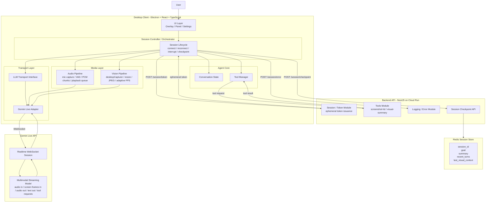
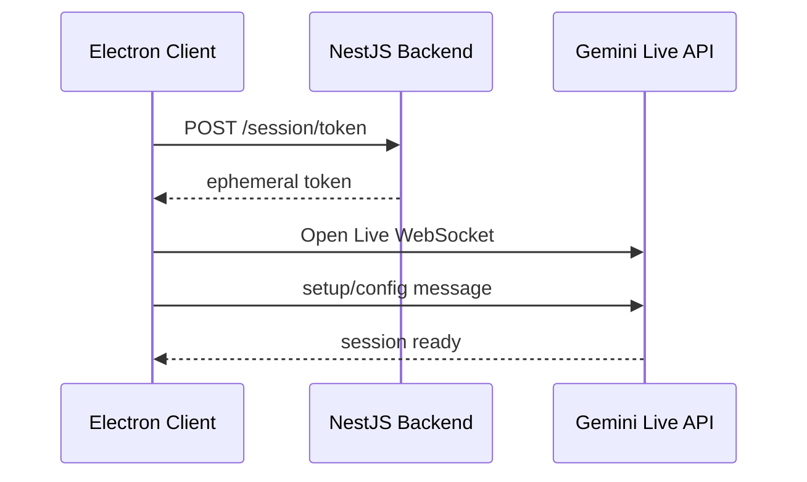
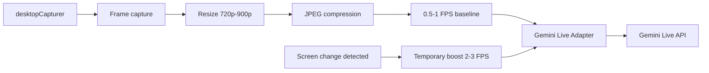
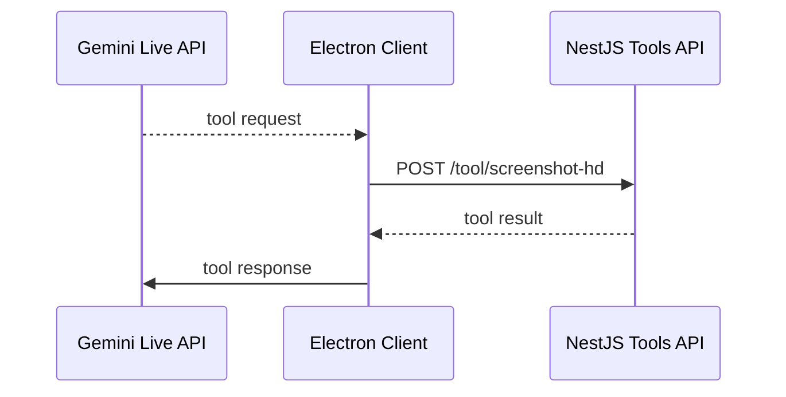
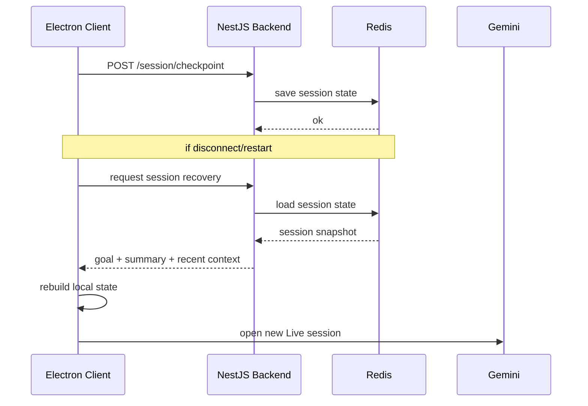

# Architecture Diagrams

This file contains the Mermaid diagram source for the main architecture and the core runtime flows of the project.

---

## 1. Main Architecture



---

## 2. Session Initialization Flow



---

## 3. Audio Flow

```mermaid
flowchart LR
    MIC[Microphone] --> CAP[Capture]
    CAP --> VAD[VAD / activity detection]
    VAD --> PCM[PCM audio chunks]
    PCM --> LIVE[Gemini Live Adapter]
    LIVE --> API[Gemini Live API]
    API --> OUT[Response audio 24kHz]
    OUT --> PLAY[Playback queue]
    PLAY --> USER[User hears response]

    USER2[User speaks during response] --> VAD2[VAD detects speech]
    VAD2 --> INT[interrupt()]
    INT --> PLAYSTOP[stop playback / clear queue]
```

---

## 4. Vision Flow



---

## 5. Tool Flow



---

## 6. Session Recovery Flow



---

## 7. Suggested Usage

Recommended organization in the repository:

* `ARCHITECTURE.md` → narrative architecture document
* `docs/architecture/architecture-diagrams.md` → raw diagram source and flow definitions

You can also embed selected diagrams directly into `ARCHITECTURE.md` and keep this file as the source of truth for Mermaid blocks.
