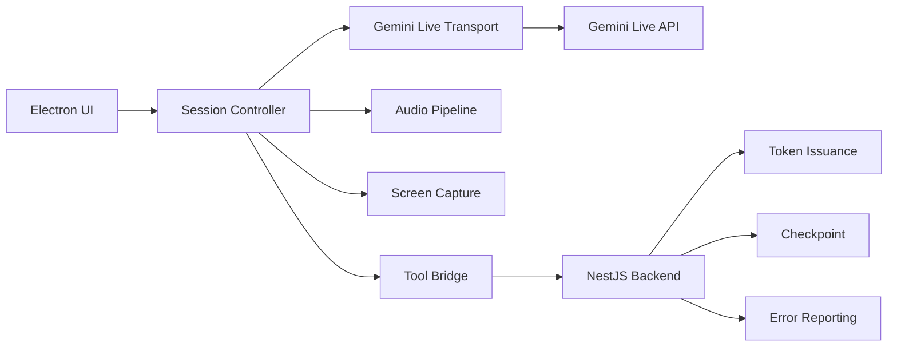

```mermaid
flowchart LR
UI[Electron UI] --> SESSION[Session Controller]
SESSION --> TRANSPORT[Gemini Live Transport]
TRANSPORT --> GEMINI[Gemini Live API]

SESSION --> AUDIO[Audio Pipeline]
SESSION --> VISION[Screen Capture]
SESSION --> TOOLS[Tool Bridge]

TOOLS --> BACKEND[NestJS Backend]
BACKEND --> TOKEN[Token Issuance]
BACKEND --> CHECKPOINT[Checkpoint]
BACKEND --> ERROR[Error Reporting]
```
