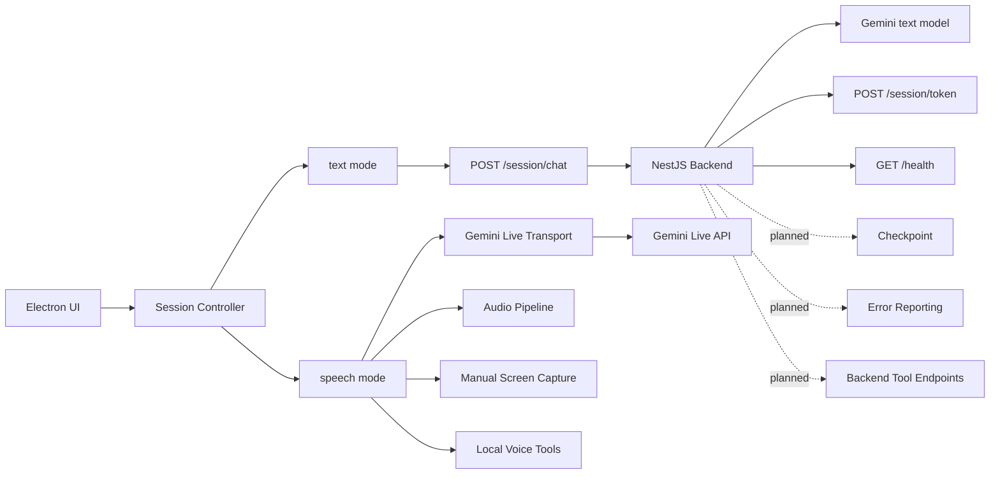

```mermaid
flowchart LR
UI[Electron UI] --> SESSION[Session Controller]
SESSION --> TEXT[text mode]
SESSION --> SPEECH[speech mode]

TEXT --> CHAT[POST /session/chat]
CHAT --> BACKEND[NestJS Backend]
BACKEND --> TEXTMODEL[Gemini text model]

SPEECH --> TRANSPORT[Gemini Live Transport]
TRANSPORT --> GEMINI[Gemini Live API]
SPEECH --> AUDIO[Audio Pipeline]
SPEECH --> VISION[Manual Screen Capture]
SPEECH --> TOOLS[Local Voice Tools]

BACKEND --> TOKEN[POST /session/token]
BACKEND --> HEALTH[GET /health]
BACKEND -. planned .-> CHECKPOINT[Checkpoint]
BACKEND -. planned .-> ERROR[Error Reporting]
BACKEND -. planned .-> REMOTETOOLS[Backend Tool Endpoints]
```
