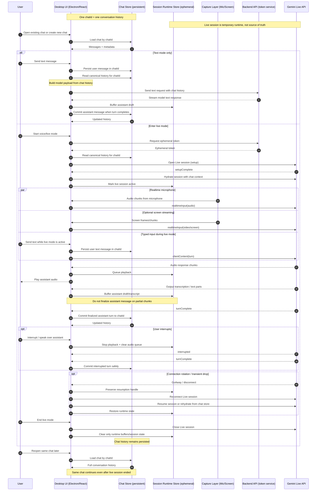

```mermaid
sequenceDiagram
    autonumber

    participant U as User
    participant UI as Desktop UI (Electron/React)
    participant CS as Chat Store (persistent)
    participant SS as Session Runtime Store (ephemeral)
    participant CAP as Capture Layer (Mic/Screen)
    participant API as Backend API (token service)
    participant GL as Gemini Live API

    Note over UI,CS: One chatId = one conversation history
    Note over SS,GL: Live session is temporary runtime, not source of truth

    U->>UI: Open existing chat or create new chat
    UI->>CS: Load chat by chatId
    CS-->>UI: Messages + metadata

    alt Text mode only
        U->>UI: Send text message
        UI->>CS: Persist user message in chatId
        UI->>CS: Read canonical history for chatId
        Note over UI: Build model payload from chat history
        UI->>API: Send text request with chat history
        API-->>UI: Stream model text response
        UI->>SS: Buffer assistant draft
        UI->>CS: Commit assistant message when turn completes
        CS-->>UI: Updated history
    else Enter live mode
        U->>UI: Start voice/live mode
        UI->>API: Request ephemeral token
        API-->>UI: Ephemeral token
        UI->>CS: Read canonical history for chatId
        UI->>GL: Open Live session (setup)
        GL-->>UI: setupComplete
        UI->>GL: Hydrate session with chat context
        UI->>SS: Mark live session active

        par Realtime microphone
            CAP->>UI: Audio chunks from microphone
            UI->>GL: realtimeInput(audio)
        and Optional screen streaming
            CAP->>UI: Screen frames/chunks
            UI->>GL: realtimeInput(video/screen)
        and Typed input during live mode
            U->>UI: Send text while live mode is active
            UI->>CS: Persist user text message in chatId
            UI->>GL: clientContent(turn)
        end

        GL-->>UI: Audio response chunks
        UI->>SS: Queue playback
        UI-->>U: Play assistant audio

        GL-->>UI: Output transcription / text parts
        UI->>SS: Buffer assistant draft/transcript

        Note over UI,SS: Do not finalize assistant message on partial chunks
        GL-->>UI: turnComplete
        UI->>CS: Commit finalized assistant turn to chatId
        CS-->>UI: Updated history

        opt User interrupts
            U->>UI: Interrupt / speak over assistant
            UI->>SS: Stop playback + clear audio queue
            GL-->>UI: interrupted
            GL-->>UI: turnComplete
            UI->>CS: Commit interrupted turn safely
        end

        opt Connection rotation / transient drop
            GL-->>UI: GoAway / disconnect
            UI->>SS: Preserve resumption handle
            UI->>GL: Reconnect Live session
            UI->>GL: Resume session or rehydrate from chat store
            UI->>SS: Restore runtime state
        end

        U->>UI: End live mode
        UI->>GL: Close Live session
        UI->>SS: Clear only runtime buffers/session state
        Note over CS: Chat history remains persisted
    end

    U->>UI: Reopen same chat later
    UI->>CS: Load chat by chatId
    CS-->>UI: Full conversation history
    Note over UI,CS: Same chat continues even after live session ended
```