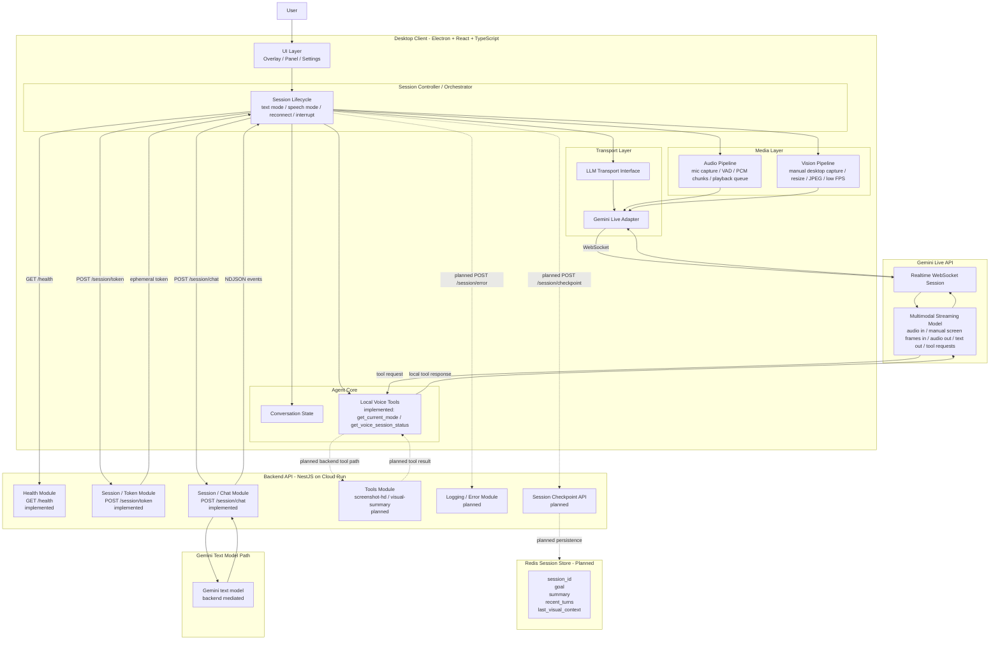

# Main Architecture (Current Repository State)

```mermaid
flowchart TB
    U[User]

    subgraph C[Desktop Client - Electron + React + TypeScript]
        UI[UI Layer<br/>Overlay / Panel / Settings]

        subgraph ORCH[Session Controller / Orchestrator]
            SC[Session Lifecycle<br/>text mode / speech mode / reconnect / interrupt]
        end

        subgraph MEDIA[Media Layer]
            AP[Audio Pipeline<br/>mic capture / VAD / PCM chunks / playback queue]
            VP[Vision Pipeline<br/>manual desktop capture / resize / JPEG / low FPS]
        end

        subgraph CORE[Agent Core]
            AC[Conversation State]
            TM[Local Voice Tools<br/>implemented: get_current_mode / get_voice_session_status]
        end

        subgraph ADAPTER[Transport Layer]
            LLM[LLM Transport Interface]
            GLA[Gemini Live Adapter]
        end
    end

    subgraph B[Backend API - NestJS on Cloud Run]
        HEALTH[Health Module<br/>GET /health<br/>implemented]
        AUTH[Session / Token Module<br/>POST /session/token<br/>implemented]
        CHAT[Session / Chat Module<br/>POST /session/chat<br/>implemented]
        TOOLS[Tools Module<br/>screenshot-hd / visual-summary<br/>planned]
        LOG[Logging / Error Module<br/>planned]
        SVC[Session Checkpoint API<br/>planned]
    end

    subgraph R[Redis Session Store - Planned]
        RS[session_id<br/>goal<br/>summary<br/>recent_turns<br/>last_visual_context]
    end

    subgraph G[Gemini Live API]
        WS[Realtime WebSocket Session]
        MODEL[Multimodal Streaming Model<br/>audio in / manual screen frames in / audio out / text out / tool requests]
    end

    subgraph GT[Gemini Text Model Path]
        TXT[Gemini text model<br/>backend mediated]
    end

    U --> UI
    UI --> SC

    SC --> AP
    SC --> VP
    SC --> AC
    SC --> TM
    SC --> LLM
    LLM --> GLA

    GLA -->|WebSocket| WS
    WS --> MODEL
    MODEL --> WS
    WS --> GLA

    AP --> GLA
    VP --> GLA

    SC -->|GET /health| HEALTH
    SC -->|POST /session/token| AUTH
    AUTH -->|ephemeral token| SC
    SC -->|POST /session/chat| CHAT
    CHAT --> TXT
    TXT --> CHAT
    CHAT -->|NDJSON events| SC

    MODEL -->|tool request| TM
    TM -->|local tool response| MODEL

    TM -. planned backend tool path .-> TOOLS
    TOOLS -. planned tool result .-> TM

    SC -. planned POST /session/checkpoint .-> SVC
    SVC -. planned persistence .-> R

    SC -. planned POST /session/error .-> LOG
```
