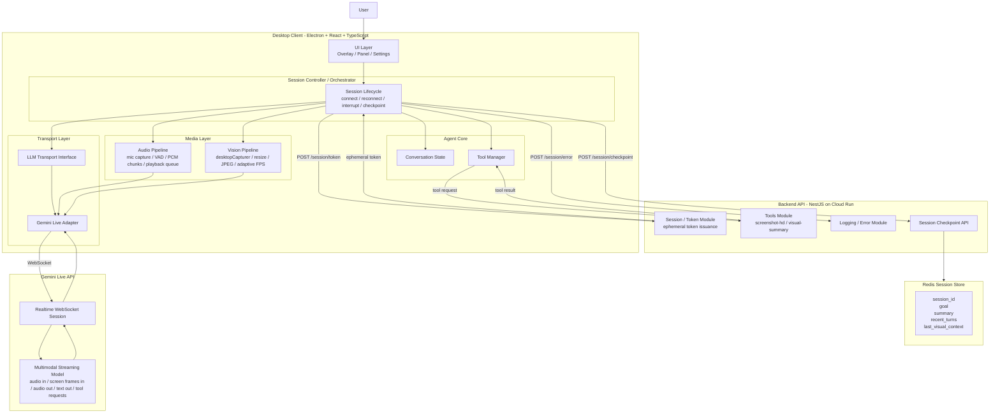

# Main Architecture

```mermaid
flowchart TB
    U[User]

    subgraph C[Desktop Client - Electron + React + TypeScript]
        UI[UI Layer<br/>Overlay / Panel / Settings]

        subgraph ORCH[Session Controller / Orchestrator]
            SC[Session Lifecycle<br/>connect / reconnect / interrupt / checkpoint]
        end

        subgraph MEDIA[Media Layer]
            AP[Audio Pipeline<br/>mic capture / VAD / PCM chunks / playback queue]
            VP[Vision Pipeline<br/>desktopCapturer / resize / JPEG / adaptive FPS]
        end

        subgraph CORE[Agent Core]
            AC[Conversation State]
            TM[Tool Manager]
        end

        subgraph ADAPTER[Transport Layer]
            LLM[LLM Transport Interface]
            GLA[Gemini Live Adapter]
        end
    end

    subgraph B[Backend API - NestJS on Cloud Run]
        AUTH[Session / Token Module<br/>ephemeral token issuance]
        TOOLS[Tools Module<br/>screenshot-hd / visual-summary]
        LOG[Logging / Error Module]
        SVC[Session Checkpoint API]
    end

    subgraph R[Redis Session Store]
        RS[session_id<br/>goal<br/>summary<br/>recent_turns<br/>last_visual_context]
    end

    subgraph G[Gemini Live API]
        WS[Realtime WebSocket Session]
        MODEL[Multimodal Streaming Model<br/>audio in / screen frames in / audio out / text out / tool requests]
    end

    U --> UI
    UI --> SC

    SC --> AP
    SC --> VP
    SC --> AC
    SC --> TM
    SC --> LLM
    LLM --> GLA

    GLA -->|WebSocket| WS
    WS --> MODEL
    MODEL --> WS
    WS --> GLA

    AP --> GLA
    VP --> GLA

    SC -->|POST /session/token| AUTH
    AUTH -->|ephemeral token| SC

    TM -->|tool request| TOOLS
    TOOLS -->|tool result| TM

    SC -->|POST /session/checkpoint| SVC
    SVC --> R

    SC -->|POST /session/error| LOG
```
