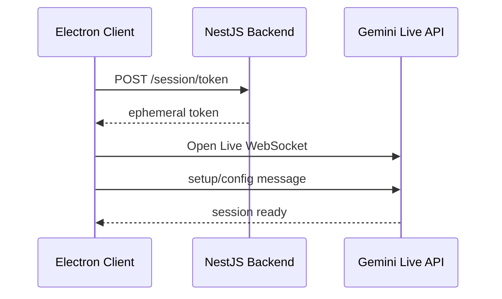

# Session Initialization Flow

```mermaid
sequenceDiagram
    participant Client as Electron Client
    participant Backend as NestJS Backend
    participant Gemini as Gemini Live API

    Client->>Backend: POST /session/token
    Backend-->>Client: ephemeral token
    Client->>Gemini: Open Live WebSocket
    Client->>Gemini: setup/config message
    Gemini-->>Client: session ready
```
