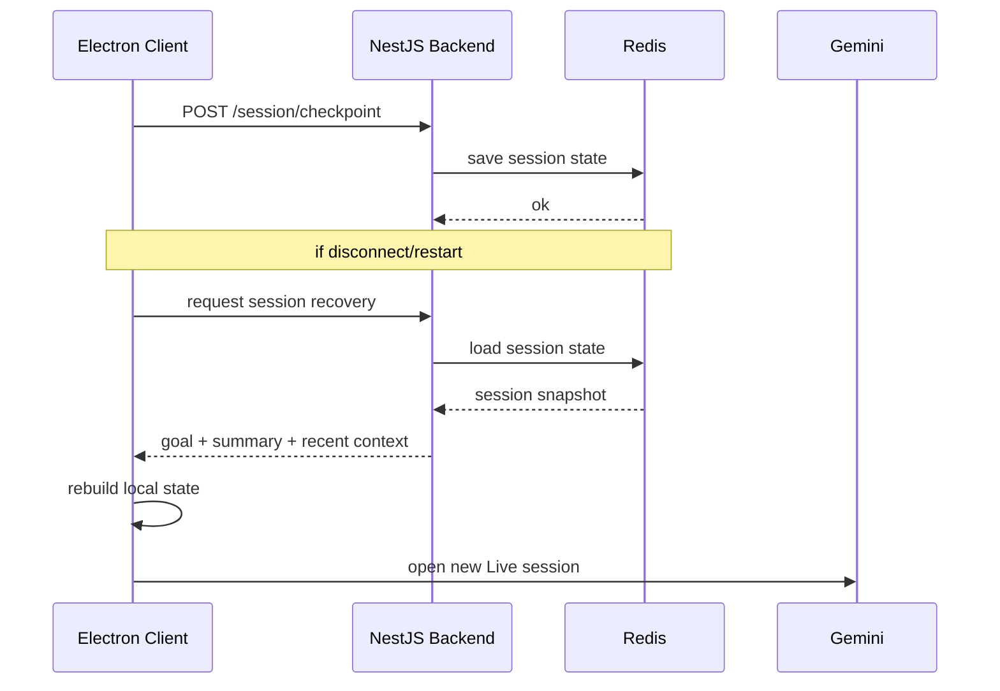

# Session Recovery Flow

```mermaid
sequenceDiagram
    participant Client as Electron Client
    participant Backend as NestJS Backend
    participant Redis as Redis

    Client->>Backend: POST /session/checkpoint
    Backend->>Redis: save session state
    Redis-->>Backend: ok

    Note over Client,Redis: if disconnect/restart

    Client->>Backend: request session recovery
    Backend->>Redis: load session state
    Redis-->>Backend: session snapshot
    Backend-->>Client: goal + summary + recent context
    Client->>Client: rebuild local state
    Client->>Gemini: open new Live session
```
