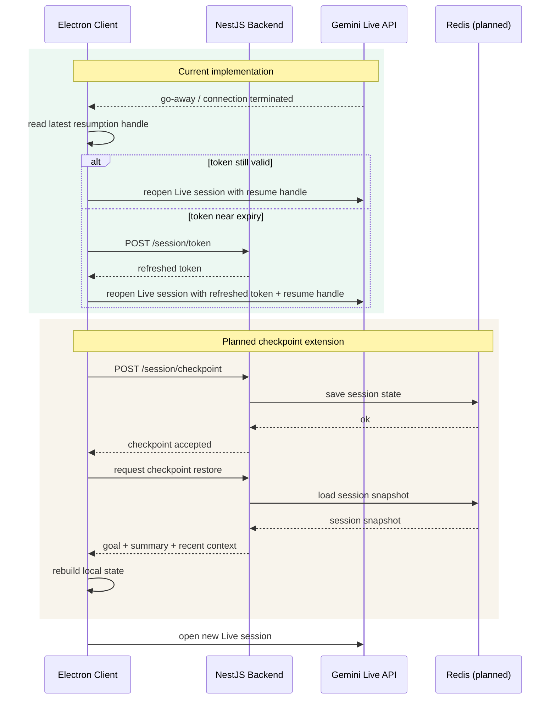

# Session Recovery Flow (Current Speech Resumption + Planned Checkpoints)

```mermaid
sequenceDiagram
    participant Client as Electron Client
    participant Backend as NestJS Backend
    participant Gemini as Gemini Live API
    participant Redis as Redis (planned)

    rect rgb(236, 248, 242)
        Note over Client,Gemini: Current implementation
        Gemini-->>Client: go-away / connection terminated
        Client->>Client: read latest resumption handle
        alt token still valid
            Client->>Gemini: reopen Live session with resume handle
        else token near expiry
            Client->>Backend: POST /session/token
            Backend-->>Client: refreshed token
            Client->>Gemini: reopen Live session with refreshed token + resume handle
        end
    end

    rect rgb(248, 244, 236)
        Note over Client,Redis: Planned checkpoint extension
        Client->>Backend: POST /session/checkpoint
        Backend->>Redis: save session state
        Redis-->>Backend: ok
        Backend-->>Client: checkpoint accepted
        Client->>Backend: request checkpoint restore
        Backend->>Redis: load session snapshot
        Redis-->>Backend: session snapshot
        Backend-->>Client: goal + summary + recent context
        Client->>Client: rebuild local state
    end

    Client->>Gemini: open new Live session
```
