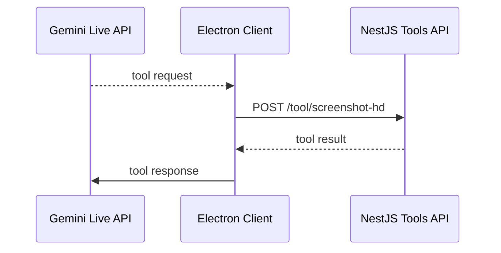

# Tool Flow

```mermaid
sequenceDiagram
    participant Gemini as Gemini Live API
    participant Client as Electron Client
    participant Backend as NestJS Tools API

    Gemini-->>Client: tool request
    Client->>Backend: POST /tool/screenshot-hd
    Backend-->>Client: tool result
    Client->>Gemini: tool response
```
