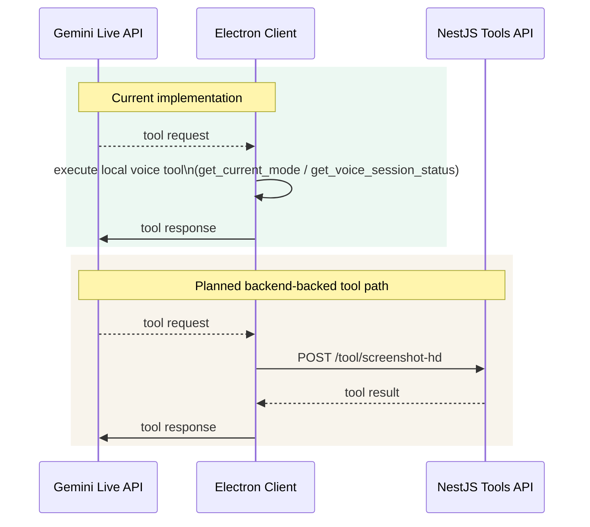

# Tool Flow (Current And Planned)

```mermaid
sequenceDiagram
    participant Gemini as Gemini Live API
    participant Client as Electron Client
    participant Backend as NestJS Tools API

    rect rgb(236, 248, 242)
        Note over Gemini,Client: Current implementation
        Gemini-->>Client: tool request
        Client->>Client: execute local voice tool\n(get_current_mode / get_voice_session_status)
        Client->>Gemini: tool response
    end

    rect rgb(248, 244, 236)
        Note over Gemini,Backend: Planned backend-backed tool path
        Gemini-->>Client: tool request
        Client->>Backend: POST /tool/screenshot-hd
        Backend-->>Client: tool result
        Client->>Gemini: tool response
    end
```
