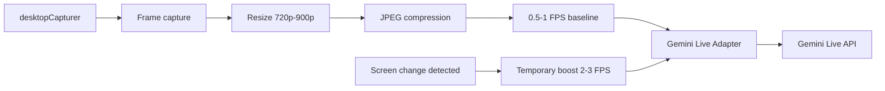

# Vision Flow

```mermaid
flowchart LR
    DC[desktopCapturer] --> FC[Frame capture]
    FC --> RSZ[Resize 720p-900p]
    RSZ --> JPG[JPEG compression]
    JPG --> FPS[0.5-1 FPS baseline]
    FPS --> LIVE[Gemini Live Adapter]
    LIVE --> API[Gemini Live API]

    CHG[Screen change detected] --> BOOST[Temporary boost 2-3 FPS]
    BOOST --> LIVE
```
