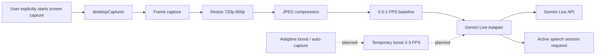

# Vision Flow (Current Manual Screen Context)

```mermaid
flowchart LR
    USER[User explicitly starts screen capture] --> DC[desktopCapturer]
    DC --> FC[Frame capture]
    FC --> RSZ[Resize 720p-900p]
    RSZ --> JPG[JPEG compression]
    JPG --> FPS[0.5-1 FPS baseline]
    FPS --> LIVE[Gemini Live Adapter]
    LIVE --> API[Gemini Live API]

    LIVE --> NOTE[Active speech session required]
    CHG[Adaptive boost / auto-capture] -. planned .-> BOOST[Temporary boost 2-3 FPS]
    BOOST -. planned .-> LIVE
```
